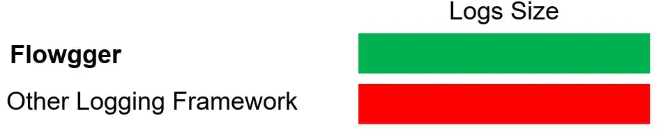
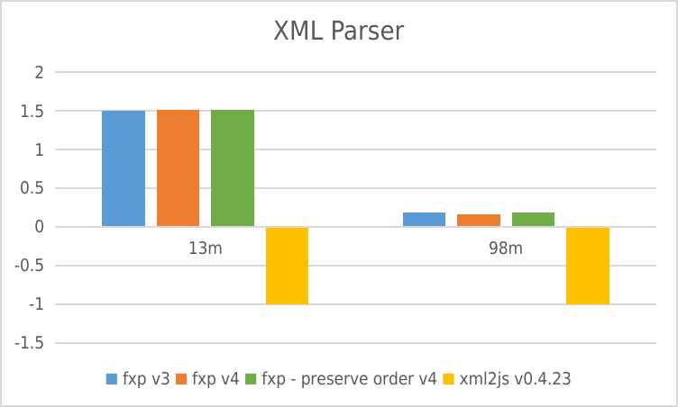
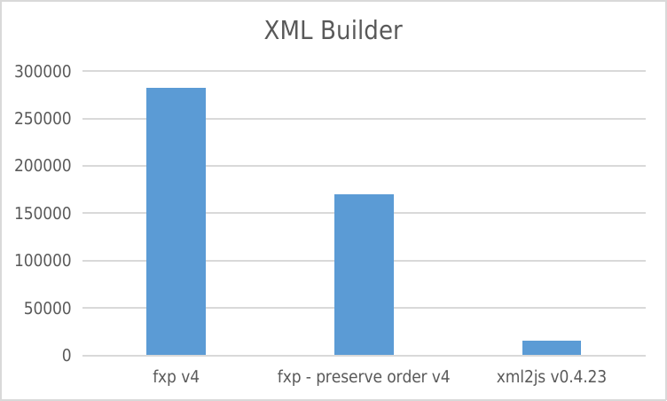

# [fast-xml-parser](https://www.npmjs.com/package/fast-xml-parser)

[](https://npm.im/fast-xml-parser)

Validate XML, Parse XML to JS Object, or Build XML from JS Object without C/C++ based libraries and no callback.


* Validate XML data syntactically. Use [detailed-xml-validator](https://github.com/NaturalIntelligence/detailed-xml-validator/) to verify business rules.
* Parse XML to JS Objectand vice versa
* Common JS, ESM, and browser compatible
* Faster than any other pure JS implementation.

It can handle big files (tested up to 100mb). XML Entities, HTML entities, and DOCTYPE entites are supported. Unpaired tags (Eg `<br>` in HTML), stop nodes (Eg `<script>` in HTML) are supported. It can also preserve Order of tags in JS object

---
# Your Support, Our Motivation

## Try out our New Thoughts

We've recently launched **Flowgger**
<a href="https://github.com/solothought/flowgger"> </a>

Don't forget to check our new library [Text2Chart](https://solothought.com/text2chart/flow) that constructs flow chart out of simple text. Very helpful in creating or alayzing an algorithm, and documentation purpose.

## Financial Support

Sponsor this project

<a href="https://github.com/sponsors/NaturalIntelligence"> 
  
</a>
<a href="https://opencollective.com/fast-xml-parser/donate" target="_blank">
  
</a>
<a href="https://paypal.me/naturalintelligence"> </a>
<br>
<br>
<br>

<!--
### Current Sponsors

Check the complete list at [ThankYouBackers](https://github.com/NaturalIntelligence/ThankYouBackers) for our sponsors and supporters.

Through Github

<a href="https://github.com/skunkteam" target="_blank"></a>
<a href="https://github.com/getsentry" target="_blank"></a>

Through OpenCollective

<a href="https://opencollective.com/fast-xml-parser/sponsor/0/website" target="_blank"></a>
<a href="https://opencollective.com/fast-xml-parser/sponsor/1/website" target="_blank"></a>
<a href="https://opencollective.com/fast-xml-parser/sponsor/2/website" target="_blank"></a>
<a href="https://opencollective.com/fast-xml-parser/sponsor/3/website" target="_blank"></a>
<a href="https://opencollective.com/fast-xml-parser/sponsor/4/website" target="_blank"></a>
<a href="https://opencollective.com/fast-xml-parser/sponsor/5/website" target="_blank"></a>
<a href="https://opencollective.com/fast-xml-parser/sponsor/6/website" target="_blank"></a>
<a href="https://opencollective.com/fast-xml-parser/sponsor/7/website" target="_blank"></a>
<a href="https://opencollective.com/fast-xml-parser/sponsor/8/website" target="_blank"></a>
<a href="https://opencollective.com/fast-xml-parser/sponsor/9/website" target="_blank"></a>
-->


> This is a donation. No goods or services are expected in return. Any requests for refunds for those purposes will be rejected.

## Users

<a href="https://github.com/renovatebot/renovate" title="renovate" ></a>
<a href="https://vmware.com/" title="vmware" > </a>
<a href="https://opensource.microsoft.com/" title="microsoft" > </a>
<a href="http://ibm.github.io/" title="IBM" > </a>
<a href="http://www.smartbear.com" title="SmartBear Software" > </a>
<a href="http://nasa.github.io/" title="NASA" > </a>
<a href="https://github.com/prettier" title="Prettier" > </a>
<a href="http://brain.js.org/" title="brain.js" > </a>
<a href="https://github.com/aws" title="AWS SDK" > </a>
<a href="http://www.fda.gov/" title="Food and Drug Administration " > </a>
<a href="http://www.magento.com/" title="Magento" > </a>
<a href="https://github.com/SAP" title="SAP" > </a>
<a href="https://github.com/postmanlabs" title="postman" > </a>
<a href="https://github.com/react-native-community" title="React Native Community" > </a>
<a href="https://github.com/googleapis" title="Google APIs" > </a>
<a href="https://github.com/langchain-ai" title="Langchain AI" > </a>
<a href="https://github.com/withastro" title="Astro websie builder" > </a>
<a href="https://github.com/baidu" title="Baidu" > </a>
[more](./USERs.md)

<small>The list of users are mostly published by Github or communicated directly. Feel free to contact if you find any information wrong.</small>

---

# More about this library

## How to use

To use as package dependency
`$ npm install fast-xml-parser` 
or 
`$ yarn add fast-xml-parser`

To use as system command
`$ npm install fast-xml-parser -g` 

To use it on a **webpage** include it from a [CDN](https://cdnjs.com/libraries/fast-xml-parser)

**Example**

As CLI command
```bash
$ fxparser some.xml
```

In a node js project
```js
const { XMLParser, XMLBuilder, XMLValidator} = require("fast-xml-parser");

const parser = new XMLParser();
let jObj = parser.parse(XMLdata);

const builder = new XMLBuilder();
const xmlContent = builder.build(jObj);
```

In a HTML page
```html
<script src="path/to/fxp.min.js"></script>
:
<script>
  const parser = new fxparser.XMLParser();
  parser.parse(xmlContent);
</script>
```

Bundle size

| Bundle Name        | Size |
| ------------------ | ---- |
| fxbuilder.min.js   | 6.5K |
| fxparser.min.js    | 20K  |
| fxp.min.js         | 26K  |
| fxvalidator.min.js | 5.7K |

## Documents
<table>
  <tr><td>v3</td><td>v4 and v5</td><td>v6</td></tr>
  <tr>
    <td>
      <a href="./docs/v3/docs.md">documents</a>
    </td>
    <td><ol>
      <li><a href="./docs/v4/1.GettingStarted.md">Getting Started</a></li>
      <li><a href="./docs/v4/2.XMLparseOptions.md">XML Parser</a></li>
      <li><a href="./docs/v4/3.XMLBuilder.md">XML Builder</a></li>
      <li><a href="./docs/v4/4.XMLValidator.md">XML Validator</a></li>
      <li><a href="./docs/v4/5.Entities.md">Entities</a></li>
      <li><a href="./docs/v4/6.HTMLParsing.md">HTML Document Parsing</a></li>
      <li><a href="./docs/v4/7.PITags.md">PI Tag processing</a></li>
    </ol></td>
    <td><ol>
      <li></li><a href="./docs/v6/1.GettingStarted.md">Getting Started</a></li>
      <li><a href="./docs/v6/2.Features.md">Features</a></li>
      <li><a href="./docs/v6/3.Options.md">Options</a></li>
      <li><a href="./docs/v6/4.OutputBuilders.md">Output Builders</a></li>
      <li><a href="./docs/v6/5.ValueParsers.md">Value Parsers</a></li>
    </ol></td>
  </tr>
</table>

**note**: 
- Version 6 is released with version 4 for experimental use. Based on it's demand, it'll be developed and the features can be different in final release.
- Version 5 has the same functionalities as version 4.

## Performance
<small>negative means error</small>

### XML Parser




* Y-axis: requests per second
* X-axis: File size

### XML Builder


* Y-axis: requests per second

<!-- [](https://github.com/NaturalIntelligence/ads/) -->

---

## Usage Trend

[Usage Trend of fast-xml-parser](https://npm-compare.com/fast-xml-parser#timeRange=THREE_YEARS)
  
<a href="https://npm-compare.com/fast-xml-parser#timeRange=THREE_YEARS" target="_blank">
  
</a>

# Supporters
#### Contributors

This project exists thanks to [all](graphs/contributors) the people who contribute. [[Contribute](docs/CONTRIBUTING.md)].

<a href="graphs/contributors"></a>


#### Backers from Open collective

Thank you to all our backers! 🙏 [[Become a backer](https://opencollective.com/fast-xml-parser#backer)]

<a href="https://opencollective.com/fast-xml-parser#backers" target="_blank"></a>


# License
* MIT License


