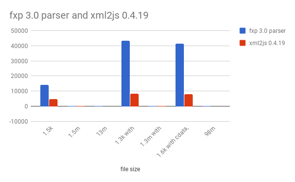
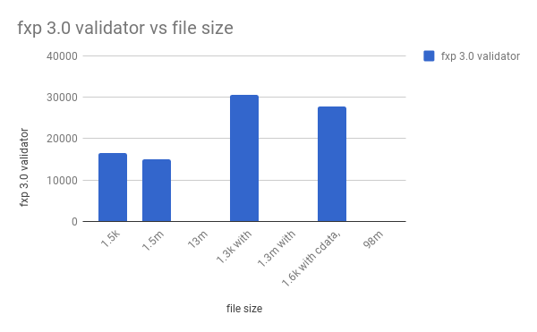
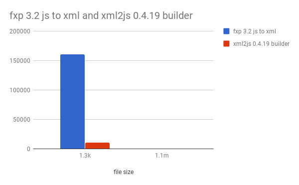

# [fast-xml-parser](https://www.npmjs.com/package/fast-xml-parser)
Validate XML, Parse XML to JS/JSON and vice versa, or parse XML to Nimn rapidly without C/C++ based libraries and no callback

 
[](#backers) [](#sponsors) [](https://snyk.io/test/github/naturalintelligence/fast-xml-parser) 
[![NPM quality][quality-image]][quality-url]
[](https://travis-ci.org/NaturalIntelligence/fast-xml-parser) 
[](https://coveralls.io/github/NaturalIntelligence/fast-xml-parser?branch=master) 
[](https://naturalintelligence.github.io/fast-xml-parser/)
[](https://www.bithound.io/github/NaturalIntelligence/fast-xml-parser/master/dependencies/npm)
[](https://www.bithound.io/github/NaturalIntelligence/fast-xml-parser) 
[](https://npm.im/fast-xml-parser)

[quality-image]: http://npm.packagequality.com/shield/fast-xml-parser.svg?style=flat-square
[quality-url]: http://packagequality.com/#?package=fast-xml-parser

<a href="https://opencollective.com/fast-xml-parser/donate" target="_blank">
  
</a>
<a href="https://www.patreon.com/bePatron?u=9531404" data-patreon-widget-type="become-patron-button"></a>
<a href="https://www.paypal.com/cgi-bin/webscr?cmd=_s-xclick&hosted_button_id=KQJAX48SPUKNC"> </a>
<a href="https://liberapay.com/amitgupta/donate"></a>


### Main Features

 

* Validate XML data syntactically
* Transform XML to JSON or Nimn
* Transform JSON back to XML
* Works with node packages, in browser, and in CLI (press try me button above for demo)
* Faster than any pure JS implementation.
* It can handle big files (tested up to 100mb).
* Various options are available to customize the transformation
    * You can parse CDATA as separate property.
    * You can prefix attributes or group them to separate property. Or can ignore them from result completely.
    * You can parse tag's or attribute's value to primitive type: string, integer, float, or boolean. And can optionally decode for HTML char.
    * You can remove namespace from tag or attribute name while parsing
    * It supports boolean attributes, if configured.


## How to use

To use it in **NPM package**  install it first

`$npm install fast-xml-parser` or using [yarn](https://yarnpkg.com/) `$yarn add fast-xml-parser`

To use it from **CLI** Install it globally with `-g` option.

`$npm install fast-xml-parser -g`

To use it on a **webpage** include it from [parser.js](https://github.com/NaturalIntelligence/fast-xml-parser/blob/master/lib/parser.js) or directly from [CDN](https://cdnjs.com/libraries/fast-xml-parser)

### XML to JSON or XML to Nimn
```js
var fastXmlParser = require('fast-xml-parser');
var jsonObj = fastXmlParser.parse(xmlData);
//construct schema manually or with the help of schema builder
var nimndata = fastXmlParser.parseToNimn(xmlData,schema);
//or
var options = {
    attributeNamePrefix : "@_",
    attrNodeName: "attr", //default is 'false'
    textNodeName : "#text",
    ignoreAttributes : true,
    ignoreNameSpace : false,
    allowBooleanAttributes : false,
    parseNodeValue : true,
    parseAttributeValue : false,
    trimValues: true,
    cdataTagName: "__cdata", //default is 'false'
    cdataPositionChar: "\\c",
    attrValueProcessor: a => he.decode(a, {isAttributeValue: true}),//default is a=>a
    tagValueProcessor : a => he.decode(a) //default is a=>a
};
if(fastXmlParser.validate(xmlData)=== true){//optional
	var jsonObj = fastXmlParser.parse(xmlData,options);
}

//Intermediate obj
var tObj = fastXmlParser.getTraversalObj(xmlData,options);
var jsonObj = fastXmlParser.convertToJson(tObj,options);

//construct schema manually or with the help of schema builder
var nimndata = fastXmlParser.convertTonimn(tObj,schema,options);

```
* NIMN (निम्न) data is the schema aware compressed form of data. It reduces JSON up to 50% or more of original data by removing field information. Check [specification](https://github.com/nimndata/spec) for more detail.
* Check [nimnjs](https://github.com/nimndata/nimnjs-node) to know more about schema, json to nimndata and reverse transformation.

**OPTIONS** :

* **attributeNamePrefix** : prepend given string to attribute name for identification
* **attrNodeName**: (Valid name) Group all the attributes as properties of given name.  
* **ignoreAttributes** : Ignore attributes to be parsed.
* **ignoreNameSpace** : Remove namespace string from tag and attribute names. 
* **allowBooleanAttributes** : a tag can have attributes without any value
* **parseNodeValue** : Parse the value of text node to float, integer, or boolean.
* **parseAttributeValue** : Parse the value of an attribute to float, integer, or boolean.
* **trimValues** : trim string values of an attribute or node
* **decodeHTMLchar** : This options has been removed from 3.3.4. Instead, use tagValueProcessor, and attrValueProcessor. See above example.
* **cdataTagName** : If specified, parser parse CDATA as nested tag instead of adding it's value to parent tag.
* **cdataPositionChar** : It'll help to covert JSON back to XML without losing CDATA position.
* **tagValueProcessor** : Process tag value during transformation. Like HTML decoding, word capitalization, etc. Applicable in case of string only.
* **attrValueProcessor** : Process attribute value during transformation. Like HTML decoding, word capitalization, etc. Applicable in case of string only.

To use from command line
```bash
$xml2js [-ns|-a|-c|-v|-V] <filename> [-o outputfile.json]
$cat xmlfile.xml | xml2js [-ns|-a|-c|-v|-V] [-o outputfile.json]
```

* -ns : To include namespaces (by default ignored)
* -a : To ignore attributes
* -c : To ignore value conversion (i.e. "-3" will not be converted to number -3)
* -v : validate before parsing
* -V : only validate

To use it **on webpage**

```js
var result = parser.validate(xmlData);
if(result !== true) cnosole.log(result.err);
var jsonObj = parser.parse(xmlData);
```

### JSON / JS Object to XML

```js
var Parser = require("fast-xml-parser").j2xParser;
//default options need not to set
var defaultOptions = {
    attributeNamePrefix : "@_",
    attrNodeName: "@", //default is false
    textNodeName : "#text",
    ignoreAttributes : true,
    cdataTagName: "__cdata", //default is false
    cdataPositionChar: "\\c",
    format: false, 
    indentBy: "  ",
    supressEmptyNode: false,
    tagValueProcessor: a=> he.encode(a, { useNamedReferences: true}),// default is a=>a
    attrValueProcessor: a=> he.encode(a, {isAttributeValue: isAttribute, useNamedReferences: true})// default is a=>a
};
var parser = new Parser(defaultOptions);
var xml = parser.parse(json_or_js_obj);

```
**OPTIONS** :

With the correct options, you can get the almost original XML without losing any information.

* **attributeNamePrefix** : Identify attributes with this prefix otherwise treat them as a tag.
* **attrNodeName**: Identify attributes when they are grouped under single property.  
* **ignoreAttributes** : Don't check for attributes. Treats everything as tag.
* **encodeHTMLchar** : This option has been removed from 3.3.4. Use tagValueProcessor, and attrValueProcessor instead. See above example.
* **cdataTagName** : If specified, parse matching tag as CDATA
* **cdataPositionChar** : Identify the position where CDATA tag should be placed. If it is blank then CDATA will be added in the last of tag's value.
* **format** : If set to true, then format the XML output.
* **indentBy** : indent by this char `when` format is set to `true` 
* **supressEmptyNode** : If set to `true`, tags with no value (text or nested tags) are written as self closing tags. 
* **tagValueProcessor** : Process tag value during transformation. Like HTML encoding, word capitalization, etc. Applicable in case of string only.
* **attrValueProcessor** : Process attribute value during transformation. Like HTML encoding, word capitalization, etc. Applicable in case of string only.

## Comparision
We've compared various libraries which transforms XML to JS. Most of them either are dependent on C/C++ libraries, or slow, or don't do reverse transformation. 

*Why not C/C++ based libraries?*
C/C++ based libraries are no doubt faster than this library but they don't run in browser, and a user need to install extra supporting libraries on their computer.

### Benchmark report

| file size | fxp 3.0 validator (rps) | fxp 3.0 parser (rps) | xml2js 0.4.19 (rps) |
| ---------- | ----------------------- | ------------------- | ------------------- |
| 1.5k | 16581.06758 | 14032.09323 | 4615.930805 |
| 1.5m | 14918.47793 | 13.23366098 | 5.90682005 |
| 13m | 1.834479235 | 1.135582008 | -1 |
| 1.3k with CDATA | 30583.35319 | 43160.52342 | 8398.556349 |
| 1.3m with CDATA | 27.29266471 | 52.68877009 | 7.966000795 |
| 1.6k with cdata,prolog,doctype | 27690.26082 | 41433.98547 | 7872.399268 |
| 98m | 0.08473858148 | 0.2600104004 | -1 |

* -1 indicates error or incorrect output.





#### Benchmark for JSON to XML

| file size | fxp 3.2 js to xml | xml2js 0.4.19 builder |
|------------|-----------------|-----------------|
| 1.3k | 160148.9801 | 10384.99401|
| 1.1m | 173.6374831 | 8.611884025|



### Worth to mention

- **[निम्न (NIMN)](https://github.com/nimndata/spec)** : Schema aware object compression. 60% more compressed than JSON. 40% more compressed than msgpack.
- **[imglab](https://github.com/NaturalIntelligence/imglab)** : Web based tool to label images for object. So that they can be used to train dlib or other object detectors. You can integrate 3rd party libraries for fast labeling.
- **[अनुमार्गक (anumargak)](https://github.com/NaturalIntelligence/anumargak)** : The fastest router for node web servers.

- [fast-lorem-ipsum](https://github.com/amitguptagwl/fast-lorem-ipsum) : Generate lorem ipsum words, sentences, paragraph very quickly.
- [stubmatic](https://github.com/NaturalIntelligence/Stubmatic) : A stub server to mock behaviour of HTTP(s) / REST / SOAP services. You can also mock msgpack, and nimn format in easy way.
- [fastify-xml-body-parser](https://github.com/NaturalIntelligence/fastify-xml-body-parser/) : Fastify plugin / module to parse XML payload / body into JS object using fast-xml-parser.
- [Grapes](https://github.com/amitguptagwl/grapes) : Flexible Regular expression engine (for java) which can be applied on char stream. (under development)

## Contributors

This project exists thanks to [all](graphs/contributors) the people who contribute. [[Contribute](CONTRIBUTING.md)].
<!-- <a href="graphs/contributors"></a> -->
### Lead Maintainers

[](https://github.com/Delagen)
								     
### Collaborators
[](https://github.com/Tatsh)
[](https://github.com/alfonsomunozpomer)
[](https://github.com/monkeywithacupcake)
[](https://github.com/EyesOnlyNet)
[](https://github.com/abbyarmada)
[](https://github.com/j0k3r)
[](https://github.com/HaroldPutman)
[](https://github.com/bb)


## Backers

Thank you to all our backers! 🙏 [[Become a backer](https://opencollective.com/fast-xml-parser#backer)]

<a href="https://opencollective.com/fast-xml-parser#backers" target="_blank"></a>


## Sponsors

Support this project by becoming a sponsor. Your logo will show up here with a link to your website. [[Become a sponsor](https://opencollective.com/fast-xml-parser#sponsor)]

<a href="https://opencollective.com/fast-xml-parser/sponsor/0/website" target="_blank"></a>
<a href="https://opencollective.com/fast-xml-parser/sponsor/1/website" target="_blank"></a>
<a href="https://opencollective.com/fast-xml-parser/sponsor/2/website" target="_blank"></a>
<a href="https://opencollective.com/fast-xml-parser/sponsor/3/website" target="_blank"></a>
<a href="https://opencollective.com/fast-xml-parser/sponsor/4/website" target="_blank"></a>
<a href="https://opencollective.com/fast-xml-parser/sponsor/5/website" target="_blank"></a>
<a href="https://opencollective.com/fast-xml-parser/sponsor/6/website" target="_blank"></a>
<a href="https://opencollective.com/fast-xml-parser/sponsor/7/website" target="_blank"></a>
<a href="https://opencollective.com/fast-xml-parser/sponsor/8/website" target="_blank"></a>
<a href="https://opencollective.com/fast-xml-parser/sponsor/9/website" target="_blank"></a>


